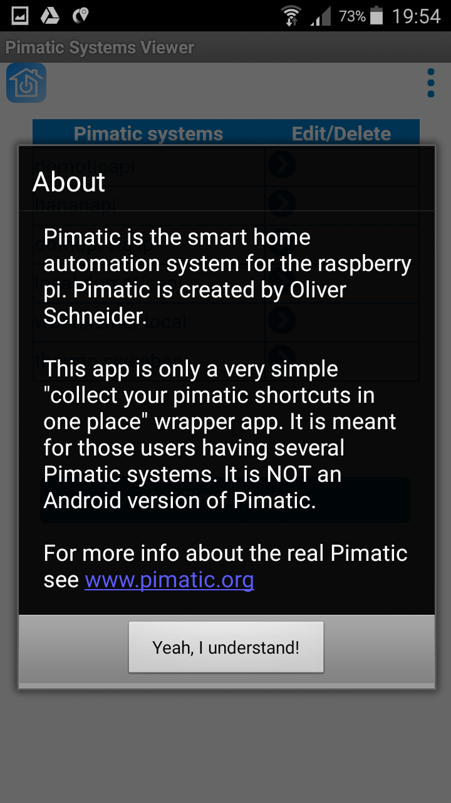

# pimatic-viewer

This app is only a very simple "collect your pimatic shortcuts in one place" wrapper app. It is meant for those users having several Pimatic systems. 
You add the url as new entry and the pimatic site will be displayed in the internal android webviewer. 
It is NOT an Android version of Pimatic. 
<TABLE border="0">
<TR><TD></TD><TD></TD><TD></TD></TR>
</TABLE>
Click images to enlarge.
